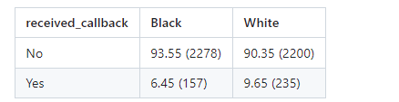
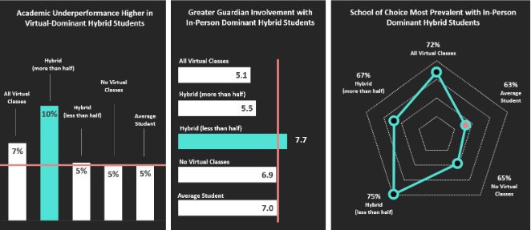
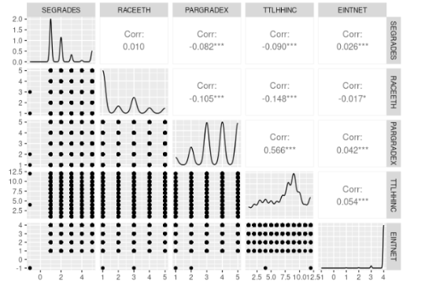
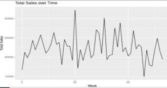
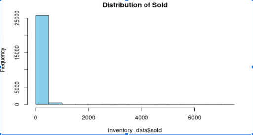

 
## Introduction

Josephat Oyondi is a data scientist at Innovative Toll Solutions LLC. My expertise lies in data cleaning, analysis, and building machine learning models to extract valuable insights from complex datasets, driving informed business decisions. Additionally, I'm adept at building robots for business process automation using UiPath, streamlining operations, and enhancing efficiency. With certifications in SAS and UiPath Advanced Developer, I am dedicated to staying at the cutting edge of technology. I'm passionate about leveraging data and automation to create innovative solutions that solve real-world challenges and contribute to business success. Always eager to explore new opportunities, I'm a continuous learner, seeking to make a positive impact through my skills and knowledge.


## Probability as a foundation of statistical modeling (objective 1)

Based on the previous competitions above, probability was significantly helpful in quantifying uncertainty, especially on predicting outcomes based on available data. Probability helps explain the likelihood of different results/outputs emerging in various situations. For example, in the second mini-competition (later discussed below), the predicted inventory needs for the company is based on the assumption that if we use items that had more than 1000 sales, then some products will be needed more than others in the future sales. However, if we reduce the number of items sold to 500, the predicted outcomes are different from the previous predictions. Additionally, probability plays a key role in statistical inference especially in hypothesis testing. For example, in building statistical models and assessing performance, significance value (p-value) and confidence level - which in this case act as probability values help make statistical inferences from data. Finally, even in assessing the maximum likelihood of particular data falling in a specific group is made possible through the probability values such as in the case of models such as K-nearest neighbors. 
Additional examples:

Given the resumes for a total of 4780 people (black and white) in an interview whereby 4478 do not receive callbacks and only 392 received call backs, in this case, probability is useful in predicting the chances of a person receiving a call back or not. That is 392/4780 which is approximately 8%. 
Similarly, we applied probability in a logistic regression model for predicting the chances of the person person receiving feedback being black or white.




The number or percentages indicated in the above table is used as in determining the chances of a randomly selected individual receiving callbacks. For instance, the probability of a a white person receiving callbacks is 9.65%. In this case, in a linear logistic model (which is used in categorical classification), probability is used in generating predictions of whether the person who received callbacks is black or white. 


## Major Projects completed


### Mini-Competition 1: Linear regression 

__Main Aim: To evaluate the relationship between parent/guradian involvement in student's education and performance__


The following are the steps we used in completing this project.


*Step 1: Exploratory data analysis*


We created different visualizations to examine the distribution of responses on school preferences, mode of learning such as in-person and virtual classes and others as shown in the screenshot below:




*Step 2:Choosing the dependent and independent variables*


There were multiple variables, however, we selected the following as the independent variables for exploration and testing the linear model:  CHLDNT, RACEETH, P1SEX, PARGRADEX, DSBLTY, TTLHHINC,EINTNET
The predicted variable was: SEGRADES which was used as a measure of student performance. 


*Step 3: Correlation analysis between variables and choosing most suitable explanatory variables using ggpairs() *




*Step 4: Final Model selection*
```{}
SEGRADES = β0 + β1CHLDNT + β2RACEETH + β3P1SEX + β4PARGRADEX + β5DSBLTY + β6TTLHHINC + β7EINTNET

```

There was no correlation between the predictors, meaning they can be used within the model in determining the students performance (grades during a school year). 


### Major Findings


1. CHLDNT (internet usage by a child in learning activities), DSBLTY (Child with disability) and P1SEX (gender of parent at home) p-values do not show any significance in predicting the child performance from virtual learning. 


2. EINTNET, TTLHHINC, PARGRADEX and RACEETH were therefore suitable in predicting the students who most benefited from virtual learning.


3. Most students were white non-hispanic, then hispanic, black non-hispanic, and asian. 


4.Higher education of parents or gardiuns (Vocational/technical education after high school or some college, College graduate, Graduate or professional school) benefited more.


5. Children from families with high total household income ($75,001 to $100,000, $100,001 to $150,000, $150,001 to $200,000) benefited more.


### Conclusion
Majority of the students who benefited did not have online classes. This means, most of the successful child’s parents preferred child interaction with teachers.


### Mini-Competition 2: Classification

__Main Aim: To predict future inventory needs for a company based on products from previous item sales__


*Step 1: Data cleaning* 

Due to the huge variation on items sold for each product, we tried different item numbers and finally settled in selecting items that have sales greater than 1000, to enhance the accuracy of the prediction model.

*Step 2: Correlational analysis*

  - Correlational analysis is important in statistical analysis and regression to help establish whether there is a relationship between the independent variables. If some independent variables have a strong correlation, then the model might not be accurate in generating predictions possibly due to overfitting. Hence, forward or backward elimination can be done at this stage to eliminate one of the variables that are correlated to enhance the reliability and accuracy of the model. 
  - Establishing correlation between the independent variables and response variable.
  - No correlation among the variables was noted
  
*Step 3: Time series analysis* 

Since the objective of this project was to predict the future inventory needs, based on historical data, time series analysis was necessary to examine the trend of sales and observe patterns. 
-  Time series analysis indicated that an unstable trend of the total sales with the highest recorded on week 20





-  The total sales were not normally distributed as shown below.





*Step 4: Data preparation and modeling*


- Due to the significant differences in maximum and minimum items sold, we selected items that had more than 1000 sales to fit and train the model.
- We selected items with at least 500 sales but the model did not converge due to sparsity - there were many weeks that had zero sales so we increased the value to 1000.
- We used  Poisson regression model to generate predictions.

- Final predictions is a csv file found on: [Final Predictions](https://github.com/ItsOyondi/activity08-mini-competition/blob/main/competition-files/inventory_needs.csv) 


*Step 5: Model selection and performance evaluation (objective 4)*

- Unlike the multiple linear regression model that uses multiple variables to show the relationship between dependent and independent variables, multiple logistic regression uses multiple independent variables to predict change of a single variable and the outputs are either true or false (categorical). Hence, multiple logistic regression models could not be used in this project as we predict future inventory needs, whereby the expected output was calculations on how many items are needed in future (continuous dependent variable).

- As noted in the exploratory distribution analysis, the data was not normally distributed. Hence, Gaussian generalized linear model (GLM) was not suitable for this project because it is appropriate for predicting the outputs of a response variable that is continuous and normally distributed. 

The overall performance of the model in generating predictions was evaluated by calculating the mean absolute error between the predicted and actual values.  


*Conclusions*

The overall performance metric of 101.8706 (e.g., average MAE) provides an indication of the average absolute difference between the actual sales data and the predicted sales values across all selected products.
Furthermore, it  indicates that, on average, the predictions made by the Poisson regression model differ from the actual total sales values by approximately 101.8706 units.


## Reflections

*My growth*

Since we started learning this course this semester, I feel I am proficient in the following areas of the course work: Regression (linear and logistic regression), single and multiple variable regression, and inference. My introduction to regression gave me an impression of machine learning, but after reading the study materials and watching the “to watch” videos, I understood the basic difference between statistical learning and machine learning. Furthermore, i was able to understand the concepts of generalized linear regression models such as Poisson classification models and discriminant analysis, concepts that were helpful in mini-competition 2 (objective 2). Contrary to other coding tools, i found it interesting to use available packages such as tidymodels and GLMnet to build models with less code, thus focusing more on addressing the task at hand than writing code from scratch. 

From this course, i was able to establish a clear connection on how concepts such as discriminant analysis (a concept i studied in STS 526) is useful in statistical modeling especially on feature selection. Furthermore, i was able to understand further understand the concept of cross-validation and by using different strategies such as k-fold cross-validation whereby different samples of data were used in evaluating the accuracy of the model in generating predictions. On the other hand, in ensuring that the best model is selected, the tutorials on forward and backward stepwise selection of features were helpful in understanding how important variables that best fit the model can be selected and how to drop unimportant variables to ensure a reliable and accurate model is selected (objective 3). 


*Active Participation in Course community*

Throughout the time of study in this course, i was actively engaged at individual level, class activities, and groups. First, i worked on most of the assigned class activities and raised a few questions on Teams, shared my feedback with my peers about their work and portfolio plans (although this one i did not receive feedback for my plan from my peers). I actively participated in both mini-competitions in brainstorming the ideas, and approach of completing our competitions. in group work, i wrote the R-codes for components we agreed with team members for me to complete. For instance, i wrote the code for the second model for competition one in evaluating the impact of parental involvement in student learning. 

For the second competition, i worked with team members to write code for exploratory data analysis, building the model, creating the presentations and presenting our findings in class discussions. Finally, i was engaged in the breakout zoom meetings to discuss with my peers on the assigned tasks as well as interact and share our personal work experiences, likes and dislikes and others. 
